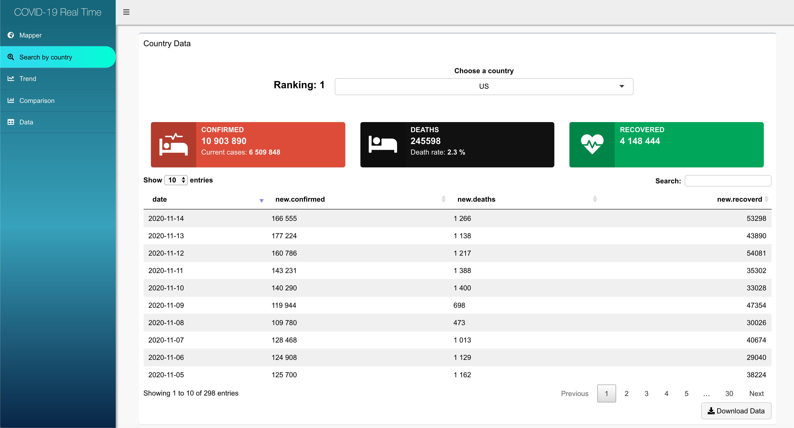

# MT5763_Shiny

## COVID-19 real time interactive tool

This github page contains the code and input data for the [COVID 19 Real Time Interactive Tool](https://fancy-statistic.shinyapps.io/shiny_covid/) developed by Jiani Liu.

Input data are obtained from the [Johns Hopkins Center for Systems Science and Engineering github page](https://github.com/CSSEGISandData/COVID-19/tree/master/csse_covid_19_data/csse_covid_19_time_series).

The Shiny app aims to develop a COVID-19 real time app with a mapping dashboard, data display boxes, trend charts and data tables with several interactive features. 
This site is updated daily based on data published by Johns Hopkins University. By looking beyond the headlines, we hope it is possible to get a deeper understanding of this unfolding pandemic.

## Shiny interface

Follow [this](https://fancy-statistic.shinyapps.io/shiny_covid/) link for the interactive Shiny app. A introduction of the interface is provided below.

Mapper

The top section of the page shows the global total cases, death cases, recovered cases, and the number of countries/regions affected by the COVID 19.
Below is an interactive map showing the current distribution of total cases around the world. The size of the red circle reflects the number of cases. When the cursor moves to the red circle, there will be a text box showing the current country/region name and total cases, active cases, death cases, recovered cases and CFR(Case-Fatality Ratio). Users can zoom in and out of a map to explore a particular country or region.
The information box on the right of the map shows the update time of the data. The first chart is a bar chart showing the number of new cases over time, and the second is a line graph showing the cumulative number of cases over time.
The data source of this app is updated once a day, but the app is updated once an hour. Users can also click "Refresh now" to get the latest data.

Search by Country

This page shows a single national data, the user can select the country they want to know, the country list is reverse ordered by the cumulative cases number, after user make a choice, the information boxes and data table will synchronous update. Users can also download the data in CSV format.

Trend

This dashboard shows the cumulative number of cases in one or more countries over time. It allows users to select one or more countries to explore or compare growth trend in different countries.

Comparison

This page with two bar charts compares the top 10 countries by number of death cases to the top 10 countries by number of recovered cases on a given date. Users can select a date in the top date box to view the comparison for that day.

Data

Users can access and download the full data here by clicking the download button.

## Analysis code

Key elements of the analysis code are as follows:
- *global.R* –  an R script that saved all functions which used to processing data.
- *app.R* - an R script that extracts and formats dynamic input time-series data from the [Johns Hopkins Center for Systems Science and Engineering github page](https://github.com/CSSEGISandData/COVID-19/tree/master/csse_covid_19_data/csse_covid_19_time_series).And used to render the Shiny app. This consists of several plotting functions as well as the ui (user interface) and server code required to render the Shiny app. 

## Updates

The [Shiny app](https://fancy-statistic.shinyapps.io/shiny_covid/) automatically updates itself based on the code in *app.R* and updated case data can be downloaded directly from the app via the 'Download data' tab.  

## Other resources

Several resources proved invaluable when building this app, including:
- A [tutorial by Florianne Verkroost](https://rviews.rstudio.com/2019/10/09/building-interactive-world-maps-in-shiny/) on building interactive maps;
- The [SuperZIP app](https://shiny.rstudio.com/gallery/superzip-example.html) and [associated code](https://github.com/rstudio/shiny-examples/tree/master/063-superzip-example);
- The [RStudio Leaflet tutorials](https://rstudio.github.io/leaflet/).

## Authors
Jiani Liu, School of Computer Science, University of St Andrews

## Contact
jl341@st-andrews.ac.uk
